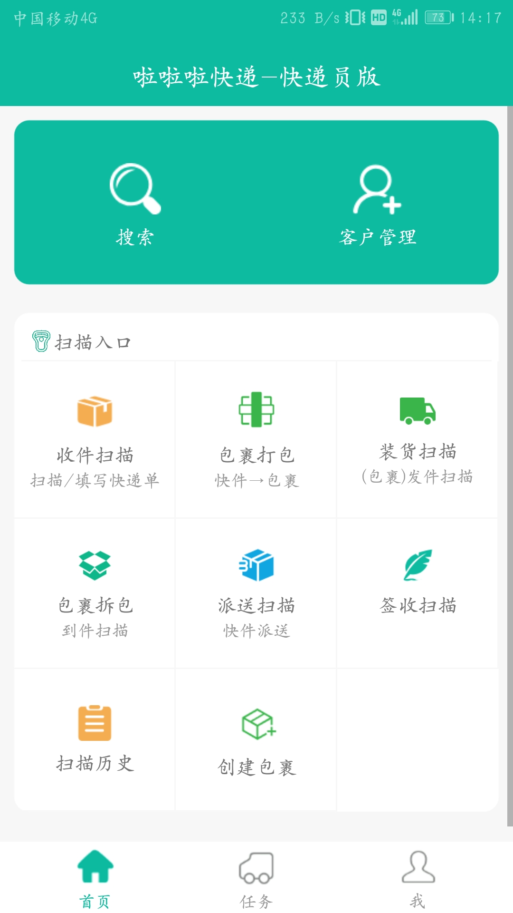
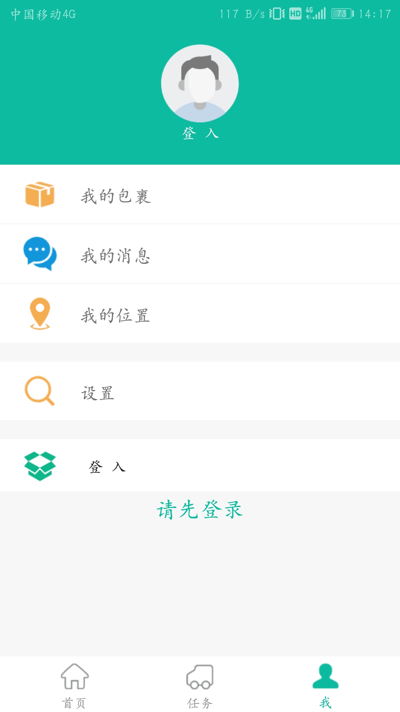

# ExpressTrace
An express tracing app base on android
本项目为课程实践项目，此app需配合后台使用（数据通过okHttp请求获取）；包括司机和快递员两种角色，分别对应不同界面
### 部分界面展示

- 首页/我的页面
<p>
  
  
</p>

### 其他说明
有空补充 :)
### 实现功能列表
#### 1. 搜索快递
快递员输入快件单号搜索当前单号的对应的时间线以及地图上的轨迹线，如果没有则返回无结果信息。
#### 2. 客户管理
快递员查看客户信息（包含客户姓名、手机号、地址、详细地址、邮编）、根据名字搜索客户、新增客户，以及修改客户信息。
#### 3. 收件扫描
所有扫描功能基于zxing-lite
用于快递员上门收件，扫描快递单号（或在识别失败情况下手动填写）进入填写快递信息页面，完善收件人、发件人信息（信息从客户信息中拉取，如果没有可新建客户信息）以及物品信息和备注信息，点击完成，收件完成。
#### 4. 创建包裹
快递员在首页点击创建包裹，选择此包裹将运往的下一网点，系统自动生成包裹条形码，快递员需打印（记录）此包裹条形码，贴于包裹上。
#### 5. 包裹打包
快递员首先扫描包裹上的条形码（或在识别失败情况下手动填写），然后进入打包页面，开始扫描快件条形码并将快件放置于此包裹中，快递员可以在此页面随时查看已装入包裹的所有快件。
快递员如果推出打包页面后，需要重新扫包裹的条形码，即可继续向其中添加快件。
#### 6.   装货扫描
司机在网点扫描处理后的包裹（或在识别失败情况下手动填写），并将包裹装入车中运往下一网点。司机一旦扫描过此包裹后，包裹关闭，既本网点的快递员将不可再向其中添加快件。
#### 7.   定位和坐标点上传（基于百度地图api）
司机开始转运包裹后，每五秒且移动超过12m以上记录位置坐标，并每隔2min且在距离上一次上传坐标的移动距离超过200m后，上传记录的一组位置坐标信息。
#### 8.   包裹拆包
快递员扫描抵达本网点的包裹上的条形码（或在识别失败情况下手动填写），打开包裹对其中快件进行分发。
#### 9.   派送扫描
快递员扫描快件单号（或在识别失败情况下手动填写），快件进入派送状态。
#### 10.  签收扫描
快递员扫描快件单号（或在识别失败情况下手动填写），快件签收成功。
#### 11.  扫描历史
快递员查看自己扫描的各种条形码的历史记录。基于sqlite。
#### 12. 任务中心
###### 1.  派送任务
快递员在派送任务列表查看未处理和已处理的派送快件。快递员可以编写短信模板，向收件人发送短信或直接拨打电话提醒其快件已达到可以取件了。
###### 2.  揽收任务
快递员在查看未处理和已处理的快件，本功能用于对客户在线寄件（既web端填写的快件）进行收件处理，点击进入收件确认页面，需完善物品信息后才可提交，若收寄件人信息有误可以重填。
此外，快递员可以编写短信模板，向客户发送短信或直接拨打电话询问。
###### 3. 转运任务
快递员点击“任务”页面可以查看抵达本快递员所在网点负责范围得的未处理的转运包裹任务和处理过的转运包裹的任务。
#### 13.  我的页面
司机或快递员查看个人处理的历史包裹；查看个人信息（包含姓名、手机号、所属网点），退出登录/切换账号

### 设计与实现
#### 1 扫码功能实现
利用ZxingLite，ZXingLite for Android 是ZXing的精简版，基于ZXing库优化扫码和生成二维码/条形码功能，扫码界面完全支持自定义，也可一行代码使用默认实现的扫码功能。总之你想要的都在这里。
引入依赖
```java
implementation 'com.google.zxing:core:3.3.3'
    implementation 'com.king.zxing:zxing-lite:1.0.6'
```
自定义了页面实现类CustomCaptureActivity 和页面布局activity_capture_custom在CustomCaptureActivity 类中实现了所有扫描功能（包含收件扫描、包裹扫描、装货扫描、拆包扫描、派送扫描以及签收扫描）的处理逻辑。在首页点击每个扫描功能跳转到扫描页面时都将传送一个意图，而CustomCaptureActivity 将根据意图向服务端发起对应请求。
#### 2 搜索快递功能的实现
1.	主页面相关的类ExpressSearchActivity，显示布局为RecyclerView的适配器类TraceListAdapter
2.	基于okHttp分别发起两个get请求获取输入单号对应的时间线json信息和坐标点的json信息
3.	基于百度地图sdk，将坐标点转化为百度地图sdk内置的LatLng对象，并以多点数组绘线的形式显示在百度地图中。
```java
//构建点坐标
LatLng p1 = new LatLng(39.97923, 116.357428);
LatLng p2 = new LatLng(39.94923, 116.397428);
LatLng p3 = new LatLng(39.97923, 116.437428);
List<LatLng> points = new ArrayList<LatLng>();
points.add(p1);
points.add(p2);
points.add(p3);
//设置折线的属性
OverlayOptions mOverlayOptions = new PolylineOptions()
        .width(10)
        .color(0xAAFF0000)
        .points(points);
//在地图上绘制线
//mPloyline 折线对象
Overlay mPolyline = mBaiduMap.addOverlay(mOverlayOptions);
```
搜索快递服务端实现：
	快递搜索分两部分，一个是地图界面的搜索，一个是文本历史信息的搜索
	其中地图界面利用packageRoute表中存储的包裹位置信息，首先根据输入的快递单号调用ExpresssheetService的express(eid)方法查询快递信息，再根据快递信息查询transpackageContent表追踪所有经过的包裹，在查询每个包裹的位置信息，进而得出快递的位置信息，使用json封装信息后传至Android或web前台，从而展示地图轨迹。
	文本历史信息的搜素，首先要判断当前快递的状态，有“已揽收”，“转运中”，“派送中”，“已签收”，每种状态对应不同深度的搜索，分了四种层次的搜索，“揽收层面”，只涉及到Expresssheet，查询揽收人和揽收时间，汇总后转成JSON。“转运层面”，在前些层的基础上，需要查询所经过的的所有包裹，追踪包裹的打包人，打包地点，拆包人，打包时间，拆包时间。“派送层面”，新增了派送人和派送时间，地点。“签收层面”，新增了签收人和签收时间。这些是层层递进的。
#### 3 客户管理
快递员登录后可以管理客户，包括浏览客户列表、查看某一客户的详细信息、修改某一客户的信息、添加客户、搜索某一具体客户。
当快递员点击客户管理时，Android端向后台发送请求获取所有用户信息。前台按照用户姓名首字母顺序排列，方便查找，快递员也可以通过搜索用户姓名或根据右部搜索条选择性查找，Android端搜索功能的具体实现如下：
```java
/**
* 根据输入框中的值来过滤数据并更新RecyclerView
*/
private void filterData(String filterStr) {
  List<SortModel> filterDateList = new ArrayList<>();
  if (TextUtils.isEmpty(filterStr)) {
    filterDateList = filledData(pp);
  }
  else {
    filterDateList.clear();
    //判断每一个用户的姓名是否含有搜索的字符串，如果有加到filterDataList中
    for (SortModel sortModel : mDateList) {
      String name = sortModel.getName();
      if (name.indexOf(filterStr.toString()) != -1) {
        filterDateList.add(sortModel);
      }
    }
  }
  // 根据a-z进行排序
  Collections.sort(filterDateList, mComparator);
  mDateList.clear();
  mDateList.addAll(filterDateList);
  mAdapter.notifyDataSetChanged();
}
```
客户管理服务端实现：
	CustomerInfoService调用CustomerInfoDao的insert,delete,update,select方法，实现客户信息的管理。当在线寄件的客户没有时，还会主动增加到数据库存储。
#### 4 收件扫描
描述：用于快递员上门收件，扫描快递单号（或在识别失败情况下手动填写）进入填写快递信息页面，完善收件人、发件人信息（信息从客户信息中拉取，如果没有可新建客户信息）以及物品信息和备注信息，点击完成，收件完成。
收件扫描成功后进入收件编辑页面,实现类为ExpressEditActivity，其中嵌套两个fragment（实现类分别为ExpressEditBaseInfoFragment 、ExpressEditAdvanceInfoFragment 代表基础信息和拓展信息），主要操作在基础信息的fragment中，显示扫描的条码、收寄件人信息以及物品信息，点击收寄件人头像进入客户列表页面点击即可选中并将其信息回显到收件编辑的基础信息中。此过程利用意图传参和有结果的请求跳转。此过程关键代码如下：
```java
//有结果的请求跳转
Intent intent = new Intent(this, CustomerManageActivity.class);
startActivityForResult(intent, REQUESTCODE_SEND);
//重写onActivityResult
 @Override
    public void onActivityResult(int requestCode, int resultCode, Intent data) {
        if (requestCode == REQUESTCODE_SEND && resultCode == RESULT_OK) {
            Bundle bundle = data.getExtras();
            expressSndID.setText(bundle.getString("id"));
            Toast.makeText(getContext(), "发件人信息已获取", Toast.LENGTH_SHORT).show();
        }else if (requestCode == REQUESTCODE_REV && resultCode == RESULT_OK){
            Bundle bundle = data.getExtras();
            expressRcvID.setText(bundle.getString("id"));
            Toast.makeText(getContext(), "收件人信息已获取", Toast.LENGTH_SHORT).show();
        }else {
            Toast.makeText(getContext(), "客户信息未获取", Toast.LENGTH_SHORT).show();
        }
    }
```
收件扫描服务端实现：
收到前台请求后，将前台传来的快件信息进行封装，组成Expresssheet类，存储到数据库，由ExpresssheetService实现。
#### 5 创建包裹
每当有一个包裹需要发往下一个网点的时候，都需要通过包裹的方式发往下一个网点，因此需要创建包裹。快递员在首页点击创建包裹，选择此包裹将运往的下一网点，系统自动生成包裹条形码，此时新建了一个包裹。快递员需打印（记录）此包裹条形码，贴于包裹上。
创建包裹服务端实现：
	读取打包人信息和快件发往网点信息，其中所在网点信息可以有TransNodeService查出，后台根据时间戳和网点信息生成包裹编码反馈给前台，完成包裹的创建。TransHistory也会同步更新。
#### 6 包裹打包
包裹打包是将快件发往下一网点的必须一步。快递员首先扫描包裹上的条形码（或在识别失败情况下手动填写），然后进入打包页面，开始扫描快件条形码并将快件放置于此包裹中，在特殊情况下快递员也可以选择手工输入快递单号。快递员可以在此页面随时查看已装入包裹的所有快件。快递员如果退出打包页面后，需要重新扫包裹的条形码，即可继续向其中添加快件。
打包服务端实现：
从得到的URL信息中读取打包人，所打的包裹条码，装包的快件条码，根据这些信息更新TransPackage,TranspackageContent,Expresssheet,TransHistory表的信息。
#### 7 装货扫描
快递员打包完成后，要进行装车扫描，这一步由司机完成，司机扫描打包好的包裹，并将包裹装车运往下一网点。完成装车扫描的包裹不能再向其中添加快件。
装货服务端实现： 
URL告诉后台装货的司机编号，包裹编号，同时意味着司机接下来的位置会被记录到TransRoute表中，代表着司机所载包裹的位置变化。
#### 8 位置定位功能的实现：
利用百度地图api,主要实现了如下方法：
```java
public class MyLocationListener extends BDAbstractLocationListener{
    @Override
    public void onReceiveLocation(BDLocation location){
        //此处的BDLocation为定位结果信息类，通过它的各种get方法可获取定位相关的全部结果
        //以下只列举部分获取经纬度相关（常用）的结果信息
        //更多结果信息获取说明，请参照类参考中BDLocation类中的说明		
        double latitude = location.getLatitude();    //获取纬度信息
        double longitude = location.getLongitude();    //获取经度信息
        float radius = location.getRadius();    //获取定位精度，默认值为0.0f		
        String coorType = location.getCoorType();
        //获取经纬度坐标类型，以LocationClientOption中设置过的坐标类型为准		
        int errorCode = location.getLocType();
        //获取定位类型、定位错误返回码，具体信息可参照类参考中BDLocation类中的说明
    }
}
```
另外自定义了MyService后台服务组件类，为了避免过于频繁上传数据对服务端造成负担，特别地将实时定位的坐标点暂时存储在持久化层（sharedPerference）中，根据自己定义的规则算法，后台定时（2min）判断是否满足上传坐标条件（距离上一次上传坐标后的移动距离超过200m）。
```java
public class MyService extends Service {
    private int Time = 1000*2*60;//周期时间2min
    @Override
    public void onCreate() {
        super.onCreate();
        TimerTask timerTask = new TimerTask() {
            @Override
            public void run() {
                String latStr = getLatLngInfo(getApplicationContext());
                uploadLoactionPoint(latStr);//上传坐标点

        };
        timer.schedule(timerTask,
                1000,//延迟1s秒执行
                Time);//周期时间
    }
}
```
定位服务端实现：
前台定时传来司机位置信息，后端根据司机所载的包裹，记录包裹的位置变化，上传保存至TransRoute表。
#### 9 包裹拆包
当包裹到达某一网点时，快递员首先要进行拆包。具体流程是：扫描包裹条码、查看确认包裹中的快件信息。快递员扫描包裹条码进行拆包操作时，会向后台请求包裹信息，Android端解析后台返回的包裹中快件信息的具体实现如下：
```java
//Json的解析类对象
JsonParser parser = new JsonParser();
//将JSON的String 转成一个JsonArray对象
JsonArray jsonArray = parser.parse(response).getAsJsonArray();
Gson gson = new Gson();
ArrayList<ExpressSheet> jsonBeanArrayList = new ArrayList<>();
//循环遍历json数组
for (JsonElement json : jsonArray) {
  //使用GSON，转成Bean对象
  ExpressSheet jsonBean = gson.fromJson(json, ExpressSheet.class);
  jsonBeanArrayList.add(jsonBean);
}
```
拆包服务端实现：
根据URL中的userId,PackageId,调用PackageService中的方法，更新PackageId对应包裹记录的状态，完成拆包。
#### 10 派送扫描和签收扫描
派送扫描和签收扫描是指快递员扫描快件后，快件进入派送状态或快件签收成功状态的功能，两者实现类似。
扫描逻辑都在CustomCaptureActivity 中。首页点击派送和签收扫描时将发送分别为REQUEST_CODE_SCAN_DISPATCH（0X104）、REQUEST_CODE_SCAN_SIGN（0X104）的意图(key为"code")，CustomCaptureActivity 将根据意图向服务端发起对应请求，根据请求结果弹出提示框说明是否成功派送或签收。
派送和签收服务端实现：
Url传来快件编号，控制器调用ExpresssheetService的paisong方法，更新快件状态，统计派送人和派送时间。根据快递编号查询对应快件的所有信息，ExpresssheetService改变所对应快件的状态，改为“已签收”。
#### 11 我的任务
快递员可以通过点击任务查看当前的派送任务，揽收任务和转运任务。
1.当快件的目的地址与当前所在网点地址一致时，快件状态变为待派送。此时快递员可以通过点击查看当前所有待派送的快件列表与已派送的快件列表。
2.当客户在网上提交快递订单信息后，快件的状态就变为未揽收，此时快递员可以通过点击查看当前与所在网点地址一样的未揽收的快件列表，快递员可以通过发送短信或拨打电话联系快件的发件人。
3.当包裹到达一个网点需要运往下一个网点时，包裹状态为“未转运”，快递员可以通过点击查看当前所有需要转运的包裹列表，当快递员经过拆包、打包、装车后，包裹状态为已转运，快递员可以查看当前所有已转运的包裹列表。
快递员可以电话或短信联系某一快件的发件人、收件人，以及电话联系上一网点、下一网点。快递员还可以编写默认短信内容。Android端具体实现如下:
```java
case R.id.msg:
  intent = new Intent(Intent.ACTION_VIEW);
  intent.setType("vnd.android-dir/mms-sms");
  //address为数据表中存放电话号码的字段
  intent.putExtra("address", (list.get(position).get("telcode")).toString());//要发短信的手机号，如果没有传空串就行
  intent.putExtra("sms_body", message);//短信内容
  startActivity(intent);
  break;
case R.id.phone:
  intent = new Intent(Intent.ACTION_DIAL, Uri.parse("tel:"+ list.get(position).get("telcode")));
  intent.setFlags(Intent.FLAG_ACTIVITY_NEW_TASK);
  startActivity(intent);
  break;
```
我的任务服务端实现：
  派送任务分为未派送和已派送
  未派送，首先查找登录快递员所在的工作网点，查询所有将要到达此地的包裹，读取其中的快件信息，如果快件的收件人所在位置也是该网点的话，该快递信息会被加入至未派送中，涉及到了TransPackage,UserInfo,TransNode,Region,Expresssheet,CustomerInfo这些表的查询。
  已派送：搜寻1个月内所有派送过的快件，查找出所有派送人是该工作人员的快件，将其信息封装展示。
  揽收分为未揽收和已揽收：
  未揽收：查询网上寄件信息，如果寄件人和快递员在同一网点范围内，这个网上寄件信息就会出现在未揽收列表里。查询寄件人RegionId,快递员RegionId,并且是未揽收的，才满足我们的搜索条件。
  已揽收：查询Expresssheet表，找到所有该快递员蓝瘦的快件，封装成JSON发给前台。
  转运分为已转运和未转运：
  未转运：查询所有正在运输的包裹，如果将要到达的网点是该工作人员的网点，就出现在未转运列表里，快递员可以查看包裹。
  已转运：该快递员打包的所有包裹会出现在已转运列表里。
#### 12 我的页面设计
  主要包括我的包裹、我的消息、我的位置、设置和重新登录。快递员可以点击我的包裹查看所有已扫描的包裹信息，通过点击我的位置查看当前所在位置信息，也可以点击个人头像进入个人信息页面，此页面主要包含姓名、电话、网点、权限设置和退出。
个人中心服务端实现：
	UserInfo的查询。

